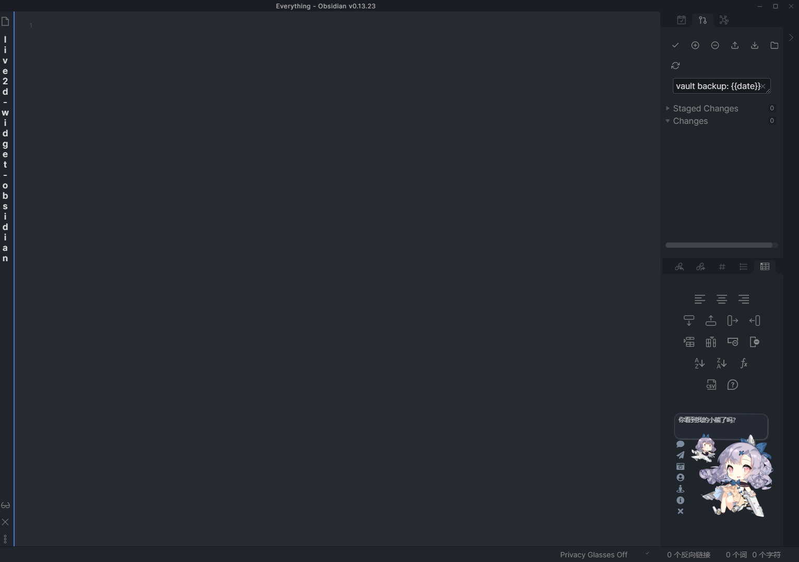
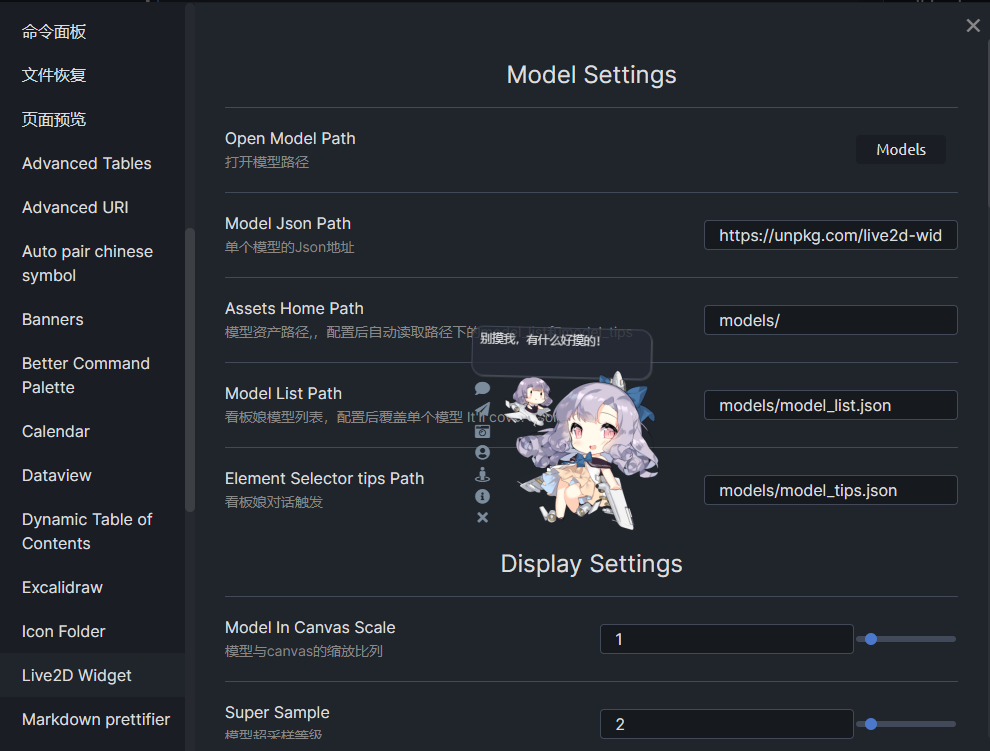
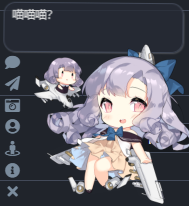

# Live2D Widget Plugin In Obsidian

该插件将会将一个live2d模型添加到界面上

This plugin will add a live2d model on the obsidian interface. Just fun for some time.

模型可在设置中自定义路径和各种工具样式

Model path can set from local or url and can custom tool style in settings.

工具介绍：
- 一言：随机一句话
- 飞机：小飞机游戏
- 照相：给模型截图
- 模型：切换模型
- 皮肤：切换皮肤
- 仓库：小挂件仓库
- 隐藏：隐藏模型

tools sidebar:
- Hitokoto: random one word
- plane: small plane game
- camera: take photo for model
- model: switch model by list path
- skin: switch model skin
- repo: go to lib repository
- hide: hide model

## Installation

### From Obsidian

1. Open `Settings` > `Third-party plugin`
2. Make sure Safe mode is **off**
3. Click `Browse community plugins`
4. Search for this plugin
5. Click `Install`
6. Once installed, enable this plugin and close the community plugins window and the plugin is ready to use.

***

1. 打开`设置`>`第三方插件`
2. 确保安全模式为`关闭`
3. 点击`浏览社区插件`
4. 搜索此插件
5. 点击`安装`
6. 安装完成后，启用该插件并关闭安装窗口，插件即可使用

### From GitHub

1. Download the Latest Release from the Releases section of the GitHub Repository
2. Put files to your vault's plugins folder: `<vault>/.obsidian/plugins/live2d-obsidian`  
3. Reload Obsidian
4. If prompted about Safe Mode, you can disable safe mode and enable the plugin.
   Otherwise, head to Settings, third-party plugins, make sure safe mode is off and
   enable the plugin from there.

> Note: The `.obsidian` folder may be hidden. On macOS, you should be able to press `Command+Shift+Dot` to show the folder in Finder.

***

1. 从GitHub仓库的Releases下载最新版本
2. 把文件放在对应Vault的插件文件夹下：`<vault>/.obsidian/plugins/live2d-obsidian`
3. 重新加载Obsidian
4. 如果出现有关安全模式的提示，则可以禁用安全模式并启用插件。否则，请转到`设置`→`第三方插件`，确保关闭安全模式，然后从`第三方插件`启用插件

> 注意，`.obsidian`文件夹为隐藏文件夹，在macOS的Finder下可以按`Command+Shift+.`以显示隐藏文件夹
